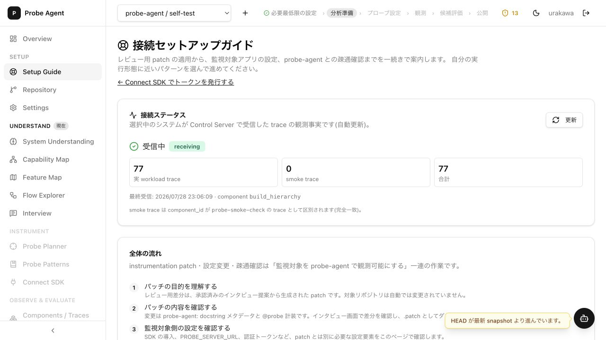
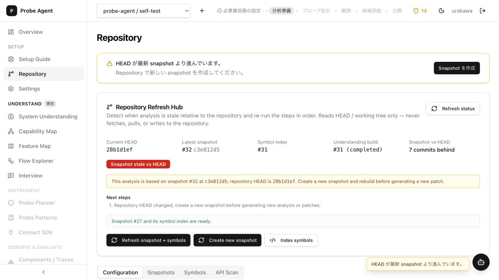
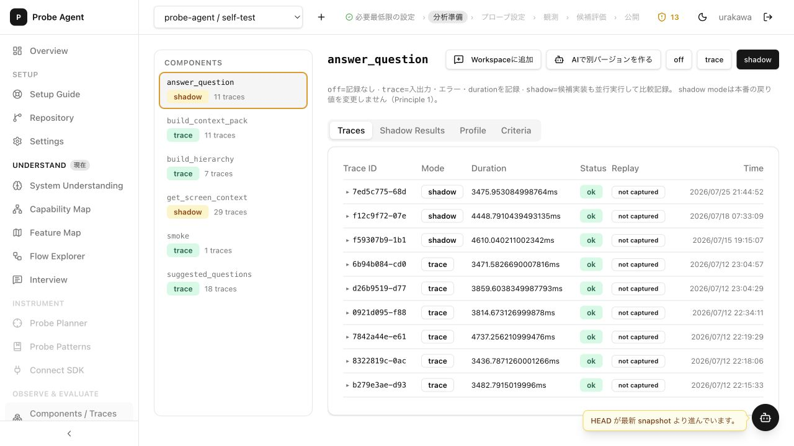
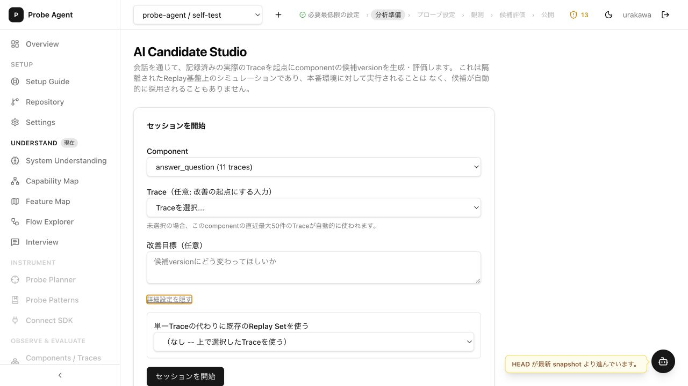
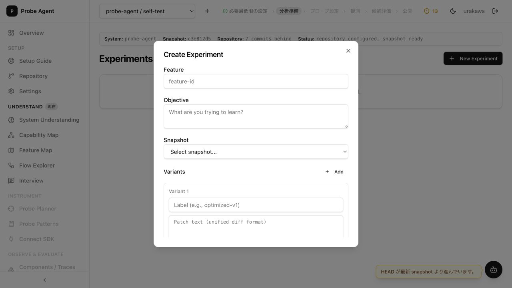

# probe-agent エンドツーエンド UX 監査

- 実施日: 2026-08-11 (Asia/Tokyo)
- 対象: `probe-agent / self-test`
- 確認範囲: Repository / Connect SDK / Setup Guide / Components & Traces / AI Candidate Studio / Simulation Workbench / Experiments
- 方法: 起動中の Dashboard (`http://localhost:8501`) を通常のデスクトップ表示で操作し、DOM・画面・関連実装を照合
- データ変更: なし。既存データに Candidate Session / Replay Set / Experiment がなかったため、生成・Replay・Experiment 作成は実行せず、後半は画面の事前状態と実装された状態遷移を確認した

## 結論

基本機能は一通り揃っており、Replay の人手承認、隔離環境である旨の明示、自動採用しない設計は安心感につながっている。一方、現状は「安全に改善ループを回せる」ことよりも、内部概念と実装状態がそのまま露出している。特に、機密値の表示、受信状態とトークン状態の誤表示は、利用者の判断を直接誤らせるため最優先で修正すべきである。

優先順位は以下の通り。

- **P0**: 情報漏えいまたは安全な利用を直ちに阻害する
- **P1**: 主要タスクの判断・完遂を高い確率で誤らせる
- **P2**: 効率、視認性、学習コストを継続的に悪化させる

## 問題一覧（優先度順）

### P0-1. Trace 詳細に機密値がマスクされず表示される

**観測**

`Components / Traces` で `answer_question` の Trace を展開すると、入力オブジェクトの文字列表現に API キーを含む設定オブジェクトがそのまま表示された。値は本報告には転記しない。実装も `t.input` を `defaultExpanded` の `JsonTree` にそのまま渡している。

**影響**

- Dashboard を閲覧できる人に秘密値が露出する
- スクリーンショット、画面共有、Workspace 追加、AI 候補生成など二次利用へ漏れる
- 巨大なシリアライズ済みオブジェクトに重要な入出力が埋もれ、視覚的な確認もしにくい

**改善案**

1. 受信時に既定の secret キー・token 形式を必ず redact し、保存前に防ぐ
2. 表示時にも多層防御として `api_key`、`token`、`password`、`authorization` などをマスクする
3. 既存 Trace を移行または削除し、漏えいしたキーはローテーションする
4. Trace 詳細は既定で折りたたみ、要約（型、件数、サイズ、redaction 有無）を先に出す

**根拠実装**: `apps/dashboard/src/pages/components.tsx:249-275`

---

### P1-1. 古い Trace が1件でもあれば永続的に「受信中」になる

**観測**

Setup Guide は「受信中 / receiving」を緑で表示しているが、最終受信は `2026/07/28 23:06:09` で、監査日時点では約14日前だった。15秒ごとに自動更新されても表示は変わらない。サーバー側の分類は時刻を見ず、実 workload Trace の累計が1件以上なら常に `receiving` となる。

**影響**

- SDK、認証、ネットワーク、workload が現在も正常だと誤認する
- 「設定からモニタリングまで」の疎通確認が成立しない
- ヘッダーの進捗判定にも同じ累積状態が使われ、過去の成功と現在の稼働が混同される

**改善案**

- `receiving_now` / `delayed` / `stale` / `never_received` の鮮度を追加する
- 「最終受信 14日前」の相対時刻を状態ラベルの直下に強調表示する
- 直近 5分・1時間・24時間の件数と期待受信間隔を表示する
- 累積到達マイルストーンと現在の稼働状態を別の指標に分離する

**根拠実装**: `apps/control-server/app/state_facts.py:308-368`, `apps/dashboard/src/pages/setup-guide.tsx:80-137`

---

### P1-2. 期限切れトークンが `active` と表示される

**観測**

Connect SDK の Access Tokens で、期限が 2026年6月・7月・8月上旬の login session が監査日時点でも緑の `active` と表示された。表示判定は `revoked` のみで、`expires_at` を考慮していない。また SDK 用 API token と login session が同じ一覧に混在している。

**影響**

- 疎通不良の原因となる期限切れを正常と誤認する
- SDK 用にどの token を使うべきか判断しにくい
- 実際には無効な token に対して削除操作だけが提示される

**改善案**

- `active / expiring_soon / expired / revoked` を時刻込みで判定する
- API token と login session をタブまたはフィルタで分離し、SDK 導線では API token を既定表示する
- 有効な API token を先頭に置き、期限までの相対時間を表示する
- revoke のアイコンボタンにラベルと確認ダイアログを付ける

**根拠実装**: `apps/dashboard/src/pages/connect-sdk.tsx:132-175`

---

### P1-3. Snapshot の鮮度と「使用可能」の表示が画面間で矛盾する

**観測**

Repository では最新 Snapshot `#32` が HEAD より7コミット古いと警告している一方、同じカード内に `Snapshot #27 and its symbol index are ready.` と表示される。ページ上部とカード内には類似の Snapshot 作成 CTA が複数ある。Experiments では `repository configured, snapshot ready` と表示し、古い ready Snapshot を通常の選択肢として提示する。

**影響**

- どの Snapshot が最新・推奨・実験に安全なのか分からない
- 古いコードを baseline にした候補生成・実験を進めやすい
- 同じ目的の CTA が競合し、クリック後に何が違うのか分かりにくい

**改善案**

- `ready`（処理完了）と `current`（HEAD一致）を別表示にする
- 推奨 Snapshot を1つだけ選択済みにし、stale なものは「過去の再現用」として折りたたむ
- stale の場合は Candidate Studio / Experiments 開始前に preflight を表示し、更新または継続理由を選ばせる
- Repository の主要 CTA を「Snapshot + symbols + understanding を最新化」の1本に統合する

---

### P1-4. 改変版作成から評価までの主導線が3つに分断されている

**観測**

候補作成・確認に `AI Candidate Studio`、`Simulation Workbench`、`Experiments` が並立する。さらに `candidate version`、`variant`、`Replay Set`、`Replay run`、`shadow`、`Experiment` が短時間に登場する。Components の「AIで別バージョンを作る」から Studio へは進めるが、Studio で評価後は「Experimentへ送る」、Experiments では最低2つの patch variant を要求する別フォームになる。

**影響**

- 「次に何をすれば完了か」が画面名から判断できない
- 直接編集、AI生成、batch experiment の違いより内部データモデルの違いが前面に出る
- 空状態ではページ間を往復しないと前提（Replay Set、approval、Snapshot）が分からない

**改善案**

主導線を以下の5段階に統一し、同じ wizard / progress rail で状態を保持する。

1. 対象と観測データを選ぶ
2. 改善目標と候補を作る
3. 安全性・Replay 可否を確認する
4. baseline と候補を比較する
5. 採否を記録し、必要なら公開へ進む

直接編集と AI 生成は手段の切替、Experiment は複数候補比較の詳細モードとして配置する。

---

### P1-5. Replay 不能であることが候補作成前に分からない

**観測**

対象 Component の11件の Trace はすべて `not captured` だったが、AI Candidate Studio の開始画面では単に `answer_question (11 traces)` と表示される。Trace 未選択時は「直近最大50件を自動的に使用」とだけ案内され、Replay 可能件数、skip 件数、redaction / サイズ超過の内訳は出ない。

**影響**

- セッションと候補を作った後で Replay できないことに気づく
- 「Trace がある」ことと「動作確認に使える」ことを誤って同一視する
- LLM 生成コストと待ち時間を無駄にする

**改善案**

- Component 選択肢を `11 traces / 0 replayable` のように表示する
- 開始前 preflight で Snapshot、symbol 解決、Replay approval、replayable trace 件数を確認する
- Replay 不能ならセッション開始を止め、`replay_capture=True` の設定方法と次の workload 実行へ誘導する

**根拠実装**: `apps/dashboard/src/pages/candidate-studio.tsx:150-227`

---

### P2-1. Trace 一覧の情報粒度が生データ寄りで、比較判断に向かない

**観測**

Duration が `3475.953084998764ms` のような過剰精度で表示され、時刻は絶対時刻のみ。期間、状態、mode、Replay 可否のフィルタや sort、検索がない。Trace 詳細は既定で全展開され、長大な repr 文字列が視線を占有する。

**影響**

- 遅い Trace、最近の異常、Replay 可能な入力を素早く見つけられない
- 数値の桁が表の横幅を消費し、主要ステータスの比較を邪魔する

**改善案**

- Duration は人間向けに `3.48 s`、詳細 tooltip で生値を出す
- 既定を「直近24時間・異常優先」にし、期間 / mode / status / replayability をフィルタ可能にする
- p50 / p95、error rate、直近増減を Component 上部に追加する

**根拠実装**: `apps/dashboard/src/pages/components.tsx:220-275`

---

### P2-2. Setup Guide が長すぎ、現在必要な操作が埋もれる

**観測**

1ページに接続状態、8段階の全体説明、patch 適用、4実行形態、認証、health check、smoke trace、workload、トラブルシューティング、環境変数一覧が連続する。最初の viewport では「受信中」と全体フローの途中までしか見えず、選択中の実行形態に対する次の操作が下方にある。

**影響**

- 正常時にもトラブルシューティングを含む大量情報を読む必要がある
- 実行形態ごとの必須手順と参考情報が同じ強さで表示される

**改善案**

- 上部を「現在の状態 / 次の1操作 / 完了条件」の3点に絞る
- 実行形態選択後、そのパターンの必須手順だけを checklist 表示する
- troubleshooting と環境変数リファレンスはエラー時または折りたたみで表示する

---

### P2-3. グローバル警告が常時重複し、文脈依存の重要情報を埋める

**観測**

`HEAD が最新 snapshot より進んでいます。` が各画面右下の固定通知として残り、Repository ではページ内バナーとカード内警告も重なる。Setup、Trace 閲覧、Candidate 作成など Snapshot 更新が当面の主操作でない画面でも同じ強さで表示される。

**影響**

- 警告疲れが起き、Trace error や Replay failure の一時通知を見落としやすい
- 右下の Assistant ボタンと競合し、狭い表示領域を占有する

**改善案**

- ヘッダーに1個の stale badge として集約する
- 候補生成・実験開始時だけ blocking preflight として再提示する
- Toast は新規イベントだけに使い、既知の持続状態には使わない

---

### P2-4. 日本語・英語・内部用語が混在し、同じ操作の呼び方も揺れる

**観測**

`Component / Trace / replay / version / variant / run / promote / snapshot / shadow` と日本語が混在し、`候補version` と `variant`、`Replayで確認` と `Run` が別画面で使い分けられる。Setup Guide と Connect SDK、Experiments は英語見出しが多い。

**影響**

- 初回利用者が概念の対応関係を学ぶ必要がある
- 「送信」「promote」「Experimentへ送る」が何を作成し、何を作成しないかを都度説明しないと安全性が伝わらない

**改善案**

- UI 用語集を定め、主語と結果を含むラベルに統一する（例: `候補を実験案に追加`）
- 内部 ID は詳細表示へ寄せ、見出しは利用者の目的語で表現する
- 日本語 UI では英語はコード・固有概念に限定する

---

### P2-5. 空状態とローディング状態の次の一歩が弱い

**観測**

Experiments は `No experiments yet. Create one to get started.`、Simulation Workbench は Replay Set を選ぶよう示すだけで、現在の Component / Trace 文脈や前提不足を具体化しない。またページ遷移直後、データ取得中に主要領域が一時的に空白となる画面がある。

**影響**

- 初回利用者は Components に戻って Replay Set を作る必要があると気づきにくい
- 読み込み中なのか空状態なのか判断できない瞬間がある

**改善案**

- 空状態に `Replay可能なTraceを選ぶ`、`候補を作る` の直接 CTA を出す
- 前提チェック結果を同じ空状態に出す
- レイアウト全体の skeleton を先に表示し、主要カードが後から跳ねないようにする

## 推奨する修正順

1. Trace の保存前 redaction、既存秘密値の除去、キーのローテーション
2. 接続状態に freshness を導入し、過去の到達と現在の稼働を分離
3. Token の expired 判定と SDK token / login session の分離
4. Snapshot の `ready` / `current` 表示と開始前 preflight の統一
5. Candidate Studio を中心とした単一の改善ループへ導線を整理
6. Replay 可否の事前表示、Trace 一覧の要約・フィルタ・丸め
7. Setup Guide の段階表示、警告・用語・空状態の整理

## 画面記録

### 接続セットアップ

### Snapshot 鮮度

### Trace 一覧

### 候補作成

### Experiment 作成

## 評価上の制約

- 既存の Candidate Session / Replay Set / Experiment は0件だったため、実データを変更する生成・Replay・Experiment 実行は行っていない
- 生成後・実行後画面は React の状態遷移、API hooks、Replay approval、result matrix、Experiment prefill 実装を確認した
- 今回はデスクトップ表示を中心に確認し、モバイル breakpoint は対象外とした
