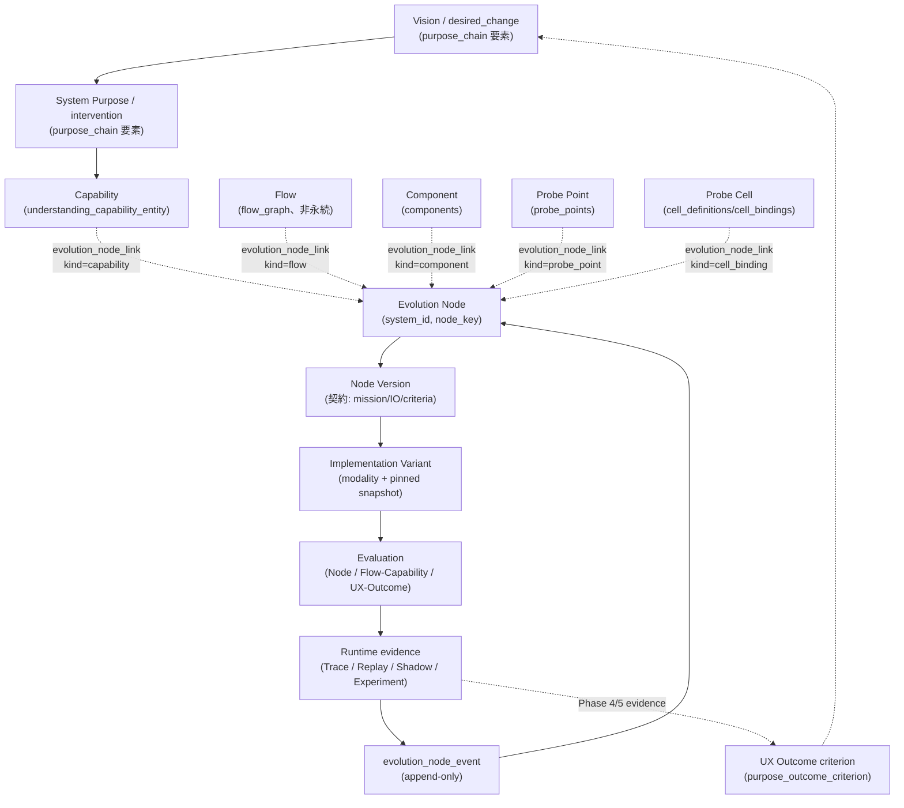

# Evolutionary Pipeline — 進化型パイプライン制御基盤(Epic #394, Phase 0 / Issue #395)

Status: Phase 0 の成果物。実装は行っていない(DB / API / UI いずれも変更なし)。
この文書自体が受け入れ条件の対象であり、以降の Phase 1〜6(#396〜#401)は
この文書が確定した語彙・境界・移行方針の内側でのみ実装してよい。

---

## 0. この文書の位置づけ

### 0.1 何を確定するか

probe-agent は既に、目的から実行まで縦に接続された多数の機構を持っている:
Purpose Chain(#387〜#391)、Probe Cell Fabric(#297〜#304)、Component / Probe
Point / Probe Plan(#25)、Candidate Studio(#252)、Replay(#242〜#246)、
Experiment(#26)、System Interview の状態駆動ワークフロー(#349)、Overview
の意思決定プロジェクション(#380)。これらは「AI が生成したものを人間が承認し、
運用しながら評価する」という同じ形の作業を、機能ごとに独立した語彙・ID・
projection で繰り返し実装してきた。

Epic #394 は、この繰り返しをこれ以上増やさずに済むように、**進化する処理単位
そのもの**(Evolution Node)を新しい正本の概念として導入する準備をする。この
文書は Issue #395 の成果物として、次の 5 つを確定する。

1. Product thesis と非目標
2. 主要概念の正本と identity owner
3. Architecture Decision Record(ADR-1〜ADR-9)
4. Migration inventory(DB / schema / API / Dashboard / domain module / docs)
5. Pilot 対象の選定

### 0.2 この文書が決めないこと

Issue #395 の非目標をそのまま踏襲する。

- Evolution Node の本番 DB テーブル・API エンドポイントの実装
- 既存テーブル・既存画面の削除
- Dashboard の全面改修
- 自動コード変換方式(ある modality から別の modality へコードを自動移行する
  仕組み)の選定
- lifecycle state を LLM に自由生成させること

これらはすべて Phase 1〜6(#396〜#401)の作業であり、その入力・出力・完了
ゲートは §8 に記す。この文書自体はコードを一切変更しない。

### 0.3 上位関係

`CLAUDE.md` の Core Design Principles と `docs/project-intelligence.md` の
既存の Issue ごとの設計判断が引き続き正本である。この文書はそれらに矛盾する
決定をしない——矛盾するように見える箇所があれば、それは #394 が誤りである
ことを意味し、この文書の記述ではなく既存の安全境界の方を優先する(§9)。
`docs/purpose-chain.md` と `docs/system-understanding-ideal-state.md` の
「新しい理解モデルを作らない」という規律は、Evolution Node にも同じ強さで
適用される(ADR-1)。

---

## 1. Product thesis と対象ユーザー

### 1.1 thesis

probe-agent がここまでに実装してきたすべての機構——Component の policy mode、
Probe Cell、Candidate Studio、Replay、Experiment——は、共通して次の問いに
答えようとしている。

> ある処理の実装は、今どれだけ「わかっている」状態にあり、その根拠は何で、
> 次に何をすれば安全に前進できるのか。

これまでこの問いは機能ごとに別の語彙で答えられてきた(Cell Improvement の
`observed→adopted`、SDK policy の `off/trace/shadow`、Interview の
`W0〜W7`)。Evolution Node は、この問いに答える**処理の単位そのもの**を
正本として持つことで、機能を横断して同じ言葉で「わかっている状態」を語れる
ようにする。

LLM の位置づけについての thesis はこの Epic の核心であり、誤読されやすいので
明示する。

> LLM は常駐する「脳」ではなく、**境界(boundary)・探索(exploration)・
> 異常の解釈(anomaly interpretation)**のための道具である。

- **境界**: 開発者の自由記述、外部ドキュメント、予測不能な入力を読む場所。
  ここは構造化できない入力を扱うので LLM が適切であり続ける(例:
  `question_router.py` が発話の自由文を分類する境界、
  `understanding_translator.py` が調査結果を意味へ翻訳する境界)。
- **探索**: まだ何が正しいコードかわからない段階で候補を作る場所(Candidate
  Studio の生成、Probe Plan のプロビング候補)。
- **異常の解釈**: ルールで判定できる範囲を超えた「これは何が起きているのか」
  を説明する場所(Phase 5 の anomaly taxonomy、#301 の系統的/個別切り分け)。

**LLM 利用を減らすこと自体はこの Epic の目的ではない**。ある Evolution Node
が `reasoning_llm` のまま安定して運用され続けることは、失敗ではなく正しい
結果でありうる——境界・探索・異常解釈の性質を持つ処理は、ルール化しようと
するほうが Principle 6 に反する(自由記述の解釈を有限集合の決定的判定に
偽装することになる)。この Epic が測定し、可視化しようとしているのは
「今この処理はどの modality で行われていて、その理由と証拠は何か」であり、
「reasoning_llm 依存を何パーセント減らしたか」という指標をどの Phase でも
KPI として採用しない。

裏を返せば、**安定して再現可能な入出力しか持たない処理が reasoning_llm の
ままなのは、それはそれで見えるべき事実**である。今回のリポジトリ内 pilot
(§7)は、実際に「もう安定しているのに reasoning_llm のまま」の例
(`interview_workflow.evaluate_candidate_state` は既に `deterministic_code`
へ安定化済みの参照例だが、これは #349 が意図的に設計した結果であり、
安定化それ自体が自動で起きたわけではないことに注意)と、「今も境界として
LLM が正しい」例の両方を選んでいる。

### 1.2 対象ユーザー

probe-agent の開発者本人(運用者)。エンドユーザー向けの機能ではない。
「自分が書いた/生成させたコードの、どの部分が今どういう根拠で安定していて、
どの部分がまだ探索段階か」を、機能を横断して一望できることを目指す。

---

## 2. ライフサイクル

### 2.1 6 段階

```text
explore(探索)
  → validate(比較評価)
    → establish(固定)
      → monitor(観測)
        → detect(異常検知)
          → local reopen(局所的な再探索)
```

- **explore**: ある Node の契約(mission / IO contract)に対して、複数の
  implementation modality の候補を並行して試す段階。この段階では本番
  トラフィックを左右しない(既存の isolated worktree / sandbox の外へ
  絶対に出ない、Principle 8)。
- **validate**: 候補を同一の evaluation(Node / Flow-Capability /
  UX-Outcome)にかけ、比較可能な形で並べる段階(#398)。単一 score へ
  合成しない(ADR-7)。
- **establish**: 安定した implementation を pin し、人間が承認する段階
  (#399)。protected floor を満たし、rollback 可能であることが条件。
- **monitor**: establish された Node を、実際に契約が守られているか
  observation で見張る段階(#400)。establish されたことと監視が実際に
  機能していることは別の事実である(ADR-5)。
- **detect**: monitor 中に異常(anomaly)を検知する段階。有限の
  anomaly taxonomy(#400)で分類し、原因不明のまま自動で何かを変更しない。
- **local reopen**: detect の結果、その Node だけを再び explore へ戻す
  段階。**本番で動いている established implementation は pin されたまま
  であり、reopen は決して production を止めない**(ADR-5)。

### 2.2 二つの状態機械の分離

Evolution Node のライフサイクルは、探索・固定・監視という**処理の中身が
どれだけ確立しているか**を表す。これは Probe Cell の Improvement status
(#304 の `observed→proposed→canary_ready→canary_running→adopted|
rejected|blocked`)とは別の状態機械である。Cell Improvement は「ある Cell
に対する 1 回の改善試行」の状態であり、Node maturity は「その Node が担う
契約そのものの成熟度」である。1 つの `established` Node の下で、Cell は
何度も improvement attempt を試し、`adopted` にも `rejected` にもなり
うる——それでも Node 自体は `established` のままでよい(#399 の
Stabilization Evidence が壊れない限り)。逆に、ある改善試行が `adopted`
されたからといって、それだけで Node の maturity が自動的に進むことはない
(ADR-9)。

### 2.3 四軸の表(ADR-6)

| 軸 | 何を答えるか | 誰が正本か(この文書時点) | 混同して結論してはならないこと |
| --- | --- | --- | --- |
| Node maturity | この Node の契約はどれだけ確立しているか | `evolution_node`(Phase 1 設計対象)+ `evolution_node_event` ログ(ADR-4) | Cell Improvement が `adopted` でも Node が `established` とは限らない。SDK policy が `shadow` でも Node が `validating` とは限らない。 |
| Cell Improvement status | ある改善試行は今どこまで進んだか | `cell_improvements` / `cell_improvement_events`(#304、既存) | Node maturity の代理指標として使わない。1 つの Node に対して複数の Improvement 試行が並行しうる。 |
| SDK policy mode | この Component は今どう計装されているか(`off`/`trace`/`shadow`) | `components.mode`(既存) | 「shadow で動いている」は「探索中である」を意味しない——`established` な Node の Component が `shadow` で追加検証を受けていることもありうる。 |
| Dashboard user phase | 開発者は今、画面上のどのステップにいるか | `system_state.derive_user_phase`(#237/#256、既存) | UI ナビゲーションのための派生値であり、他の 3 軸から**逆算**してはならない。user phase が `observation` だからといって、そこにある Node が `monitoring` とは限らない——observation は SDK 接続の有無を見ているだけで、Node 単位の契約確立を見ていない。 |

API は 4 軸を**別フィールド**として返す。1 つの合成ラベル(例:「準備完了」
のような単一の言葉)へまとめない——これは CLAUDE.md #366 が定式化した
「1 つの表示語が 2 つ以上の事実を兼ねる」欠陥を、4 軸へ拡張したものである。

---

## 3. Canonical concept map

以下は既存および新設(Phase 1 設計対象)の概念を横断した一覧である。「正本」
列はこの文書時点で実際にリポジトリに存在する行・モジュールを指す(Evolution
Node 系だけは Phase 1 の設計対象であり、まだ存在しない)。

| 概念 | identity owner | 正本(module / table) | 責務 | 何と混同してはならないか |
| --- | --- | --- | --- | --- |
| System | `systems.id` | `db.py` `systems` | 全 System-scoped データの隔離境界(テナント) | 対象リポジトリそのものではない。System はコントロールプレーン側のテナントであり、リポジトリは外部の参照先。 |
| Purpose Frame element | `kind` または `kind:sha256(name)[:16]` | `purpose_chain.py`(projection。既存行から都度導出、保存しない) | 「対象者と課題→望ましい変化→介入→Capabilities」の 4 要素を追跡可能にする | 新しい理解モデルではない(`purpose-chain.md` §0.1)。`core_capability` 要素は Capability エンティティ自体の代わりではなく、その claim レベルの投影。 |
| Capability(確認済みエンティティ) | `understanding_capability_entity.id` | `capability_graph.py` / `understanding_capability_entity(_version)`(#312) | 開発者が明示的に確定した Capability 階層構成 | Purpose Frame の `core_capability` 要素(未確定な claim)ではない。Evolution Node ではない——Capability は事業側のまとまりであり、1 つの Capability に複数の Node が `evolution_node_link(kind=capability)` で多対多に紐づきうる。 |
| Feature | `feature_drafts.id` / `feature_code_links` | `draft_generator.py`, `code_mapper.py`(#23/#24) | LLM が提案した、証拠付きの機能候補とコードシンボルへのマッピング | Capability(人間確認済みの階層)と混同しない。Feature Map は早期段階の draft evidence。 |
| UX Outcome | `purpose_outcome_criterion.id` ほか | `purpose_verification.py`(#391、既存) | `desired_change` が実際に起きたかの証拠(measure/baseline/target/observation window) | runtime trace だけから利用者の成功を推測しない(`purpose-chain.md` §4.2)。Node 単位の evaluation metric とは別の粒度。 |
| Flow | `(system_id, snapshot_id, entrypoint_ref)` から決定的に再計算 | `flow_graph.py`(#43。**永続テーブルなし**、都度再構築) | エントリポイントから出口までの実行経路の候補 | Capability ではない(Flow は実行経路、Capability は事業価値の単位)。永続 ID を持たない値であることに注意——Node が `evolution_node_link(kind=flow)` で参照する場合、参照の安定性は `entrypoint_ref` + snapshot に依存する。 |
| Component | `(system_id, component_id)` | `db.py` `components`(SDK `@probe(component_id=...)`) | SDK が可視化する実行単位。trace を発行し、policy mode を持つ | Evolution Node ではない(ADR-2)。複数の Component が 1 つの Node を実装することも、Node がまだどの Component にも紐づかないこともある。 |
| Probe Point | `probe_points.id` | `db.py` `probe_points`(#25) | Probe Plan 内で承認された 1 箇所の計装位置(path + symbol + 行範囲) | Probe Cell ではない(Probe Point は「どこに刺すか」の記録、Cell は「そこで何が動くか」の実行ロール)。 |
| Probe Cell | `cell_definitions.cell_id`(原則 `system_id + component_id`) | `db.py` `cell_definitions` / `cell_bindings`(#298/#299) | 承認済み Probe Point/Component に紐づく実行・オーケストレーションのロール(Role Card、roster、quality sampling、improvement) | Evolution Node ではない(ADR-1)。Cell の Improvement status は Node maturity ではない(ADR-6)。 |
| Evolution Node **(Phase 1 設計対象、未実装)** | `(system_id, node_key)` | `evolution_node`(Phase 1、#396) | 進化する処理単位そのもの: 契約 + implementation + maturity | Probe Cell ではない(ADR-1)。Node key は `component_id` から導出しない(ADR-2)。 |
| Node Version **(Phase 1 設計対象)** | `evolution_node_version.id`(append-only) | `evolution_node_version`(Phase 1) | mission / scope / out_of_scope / input contract / output contract / side-effect class / trust boundary / establishment 基準 / reopen 基準 / evaluation policy 参照 | Implementation Variant ではない(ADR-3)。1 つの contract に複数の implementation がありうる。 |
| Implementation Variant **(Phase 1/3 設計対象)** | `evolution_node_implementation.id`(append-only) | `evolution_node_implementation`(Phase 1)+ Exploration Workbench(#398) | modality + config/provenance 参照 + pin された snapshot/commit/environment | provider/model 名を identity に含めない(#298 の Agent Role Card と同じ規律)。 |
| Improvement Attempt | `cell_improvements.id` | `db.py` `cell_improvements`(#304、既存) | Cell 単位の 1 回の改善試行のライフサイクル | Node maturity ではない(ADR-6)。 |
| Trace | `traces.trace_id` | `db.py` `traces` ほか(既存) | 1 回の呼び出しの記録(input/output/error/duration、記録時点の policy mode) | それ単体で Node の maturity を証明しない——trace 量は利用の証拠であって、確立の証拠ではない(ADR-9)。 |
| Replay | `replay_runs.id` | `db.py` `replay_runs` / `replay_variants`(#242〜#246、既存) | 記録済み入力を pinned/edited コードへ隔離 worktree で再生する決定的比較 | live shadow ではない。産出された返り値は本番の返り値に一切影響しない。 |
| Shadow | `shadow_results.id` | `db.py` `shadow_results`(既存) | SDK `shadow` policy による、本番呼び出しに相乗りした比較(返り値には影響しない) | Replay ではない(Shadow はオンラインで本番と同時に走る、Replay はオフラインで隔離される)。 |
| Experiment | `experiments.id` | `db.py` `experiments` / `experiment_variants`(#26、既存) | baseline + candidate 群の隔離 worktree 実行と決定的メトリクス+推論解釈 | Evaluation 契約そのものではない——Experiment は評価を「実行する」機構の 1 つであり、何を評価基準とするかを決める契約ではない(ADR-7)。 |
| Evaluation | `evaluation_criteria.id`(既存)/ 3 階層契約(#397 で拡張) | `evaluation.py`, Phase 2(#397)で Node/Flow-Capability/UX-Outcome の 3 契約へ拡張 | 何をもって良し/悪しとするかの基準 | 単一の合成 score ではない(ADR-7)。quality/latency/cost/safety を混ぜて 1 数値にしない。 |
| observation mode(SDK policy) | `components.mode` | `db.py` `components`(既存) | Component が今どう計装されているか(`off`/`trace`/`shadow`) | Node maturity ではない(§2.3)。 |
| maturity | `evolution_node.maturity` **(Phase 1 設計対象)** | `evolution_node` + `evolution_node_event` ログ(ADR-4) | Node 契約の成熟度: `exploring`/`validating`/`established`/`monitoring`/`reopened`/`suspended` | Cell Improvement status ではない、SDK policy mode ではない、user phase ではない(ADR-6)。 |
| user phase | `UserPhaseResult`(値、非永続) | `system_state.py` `derive_user_phase`(#237/#256、既存) | 開発者が画面上どのステップにいるかの UI 用派生値 | 他 3 軸から逆算しない、他 3 軸を決定しない(§2.3)。 |

### 3.1 lineage 図



この図が表す不変条件は 2 つ: (1) Node は Purpose Chain / Capability /
Flow / Component / Probe Point / Cell という**既存の 6 種の資産へ参照で
リンクするだけ**で、それらの正本行を書き換えない(ADR-2)。(2)
`evolution_node_event` は Runtime evidence から Node へ戻る**唯一の書き込み
経路**であり、maturity のどんな変化も必ずこのログを経由する(ADR-4)。

---

## 4. Architecture Decisions

以降の ADR-1〜9 は Epic のオーナー(orchestrator)によって既に決定済みであり、
この文書はそれを設計の正本として記録する。각 ADR は 決定 / 理由 / 却下した
代替案 / 影響 / 検証方法 の順で書く。

### ADR-1 — Evolution Node は Probe Cell 契約のバージョンアップではなく、新しい正本エンティティである

**決定**: Evolution Node を新しい canonical entity として追加する。Probe
Cell(#297〜#304)の既存テーブル・schema は一切変更しない。

**理由**: Probe Cell は**実行ロール**(Agent Role Card、オーケストレーション、
quality sampling、improvement attempt、span-of-control)を所有する。Evolution
Node は**進化する処理単位そのもの**(business I/O contract、implementation
modality、maturity、establish/reopen 基準、rollback pin)を所有する。この 2
つを 1 つの行に畳み込むと、1 つのテーブルが 2 つの identity owner を持つ
ことになり、#394 が解消しようとしている核心の混同——「Node の成熟度 ≠ Cell
の Improvement status」——がそもそも表現不能になる。

**却下した代替案**: `cell_definition.schema.json` をバージョンアップして
maturity フィールドを追加する案。却下理由は 2 つ。第一に、Node はまだ
probe point が存在しない処理(設計段階、Phase 2)のためにも存在する必要が
あり、Cell は常に承認済み Probe Point の存在を前提とする——Cell を持たない
Node が構造的にありえる。第二に、`rule` や `deterministic_code` の Node は
将来にわたって常駐 LLM プロセス(Cell)を一度も必要としない——Cell への
統合は「いずれ resident agent になる」ことを暗黙に仮定してしまう。

**影響**: Cell は一切変更されない(既存 #298〜#304 のテーブル・API・
schema はこの Epic の間、読み取り専用の参照先であり続ける)。Node は
`evolution_node_link(kind=cell_binding)` を通じて Cell を**参照する**。

**検証方法**: Phase 1(#396)の互換性テストで、`cell_definitions` /
`cell_bindings` / `agent_role_cards` の CREATE TABLE 定義が Node 実装の
前後でバイト単位で同一であることを assert する。

### ADR-2 — Node identity は `(system_id, node_key)`

**決定**: `node_key` は開発者が付ける安定した slug で、System 内で一意。
`component_id` から導出しない。既存資産へのリンクは追記専用の
`evolution_node_link` テーブルへ、有限の `link_kind`(`component` |
`probe_point` | `cell_binding` | `capability` | `flow` | `purpose_element`
| `feature`)で持つ。

**理由**: Node は Component が存在するより前(Phase 2 の設計段階)に定義
されうるし、複数の Component にまたがることもある。`component_id` から
`node_key` を導出すると、Component が rename されたときに Node identity が
失われる、あるいは 1 Node : 1 Component という誤った 1 対 1 前提を schema
レベルで固定してしまう。

**却下した代替案**: `component_id` を Node の主キーの一部にする案。却下
理由は上記に加え、`probe_agent`(SDK)の `component_id` は対象リポジトリ
コードが所有する識別子であり、Control Server 側の設計時エンティティである
Node の identity をそこへ従属させると、対象リポジトリのリファクタリングが
Control Server 側の設計成果物(Node)まで巻き添えにしてしまう。

**影響**: `evolution_node_link` は追記専用。古いリンクは「消える」のでは
なく、無効化イベント(ADR-4 の event log)で `superseded` として残る。

**検証方法**: Phase 1 契約テストで、承認されていない Probe Point/Probe
Pattern への `link_kind=probe_point` 作成が拒否されること(#299 の
既存ルールと同じ 409/422)、および Component が rename された後も既存
Node の `node_key` が変化しないことを assert する。

### ADR-3 — Node の contract version と implementation は別モデルである

**決定**: `evolution_node_version`(mission / scope / out_of_scope / input
contract / output contract / side-effect class / trust boundary /
establishment criteria / reopen criteria / evaluation policy 参照。
append-only)と `evolution_node_implementation`(modality + config 参照 +
pin された snapshot/commit/environment。append-only)を分離する。1 つの
contract version は複数の implementation を持てる。

**理由**: この Epic の核心の要求——「同じ Node の LLM 実装とルール実装を、
同じ評価の下で比較する」——は、Node が「何を約束しているか」と「今どう
その約束を守っているか」が別々にバージョン管理されて初めて表現できる。
両者を 1 つの行に混ぜると、実装を切り替えるたびに契約(何を約束したか)
まで新しいバージョンになってしまい、比較対象が「同じ Node」であることを
主張できなくなる。

**却下した代替案**: 実装ごとに Node 行そのものを複製する案(「rule 版
Node」「LLM 版 Node」を別々の Node として登録する)。却下理由は、これでは
2 つの Node が「たまたま同じことをしている」のか「同じ約束の異なる実装」
なのかを、Node identity だけからは区別できなくなるため。比較評価
(#398)が前提とする「同一 Node、異なる implementation」という関係が
構造的に失われる。

provider/model 名は binding の identity に含めない——#298 の Agent Role
Card の `model_alias` と同じ規律を踏襲し、versioned な config/provenance
側に置く。

**影響**: `evolution_node_implementation` の切り替えは契約変更を伴わない
限り新しい `evolution_node_version` を作らない。逆に契約が変わる(input/
output contract や establishment criteria の変更)場合は、既存の
implementation との対応関係を明示しなければならない。

**検証方法**: Phase 1 契約テストで、同一 `evolution_node_version` に
`modality` の異なる複数の `evolution_node_implementation` を紐づけられる
こと、provider/model の実名が identity にもレスポンスにも(config 参照を
除いて)含まれないことを assert する。

### ADR-4 — maturity は node 行に保存されるが、常に append-only の event log と整合する

**決定**: すべての maturity 遷移は `evolution_node_event`(actor /
actor_kind / decision_method / reason / evidence 参照 / from_state /
to_state / from_version / to_version / timestamp / idempotency key)を
書く。event log を畳み込んで得られる maturity は、保存されている
`evolution_node.maturity` と常に一致しなければならない。

**理由**: #337 / #338 / #349 が既に採用している規律(「保存された
lifecycle 値は、それを説明する行から乖離しうるが、導出された値は
乖離しえない」)を Evolution Node にも適用する。保存値だけを信頼すると、
手動の DB 修正やバグによる不整合が検出不能になる——event log からの
再導出は、それ自体が整合性検査になる。

**却下した代替案**: maturity を `evolution_node_event` の最新行から**毎回
動的に計算し、専用カラムを持たない**案。却下理由は、読み取りのたびに
イベント全件を畳み込むコストと、「今の maturity は何か」という頻出クエリ
のためにインデックス可能な列を持つ運用上の必要性——ただし整合性の
最終的な権威は event log 側に置く、という設計判断自体は #337/#338 と
同じ側に倒している。

**影響**: すべての Phase 1 API(`transition` エンドポイント)は、状態列の
UPDATE と event の INSERT を同一トランザクションで行う。

**検証方法**: Phase 1 契約テストで、任意の `evolution_node` 行に対して
「そのノードの event を時系列で畳み込んだ結果」と「保存されている
maturity」が常に一致することを assert する(#337 の premise 検証テストと
同じ形)。

### ADR-5 — `established` と `monitoring` は別状態である

**決定**: `established` = 固定の決定が承認され、安定した implementation が
pin されている。`monitoring` = `established` かつ、実際に稼働中の
monitoring contract がその Node を観測している。`reopened` は安定
implementation の pin を外さない。`suspended` はどの状態からも到達できる
安全停止であり、成熟の達成ではない。

**理由**: 「安定していると判断した」ことと「今実際に見張っている」ことは
独立に失敗しうる。テレメトリはその決定の正しさとは無関係に止まりうる——
それは CLAUDE.md #366 が定式化した「1 つの表示語が 2 つの事実を兼ねる」
欠陥と同型であり、Phase 5(#400)は「決定は健全だが監視が死んでいる」
状態を表示できなければならない。両者を 1 つの `established` へ畳み込むと、
死んだテレメトリを持つ Node と、健全に観測され続けている Node が画面上
区別できなくなる。

`reopened` が pin を外さないのは、探索の再開が本番トラフィックへ即座に
影響してはならないという Principle 1 の延長(Safety first)。

**却下した代替案**: `established` 1 状態のまま、監視の有無を別の boolean
フラグ(`is_monitored`)として付随させる案。却下理由は、この文書が §2.3で
禁じている「4 軸を混ぜない」規律の先取りであり、maturity という 1 つの
軸の中でさらに「決定」と「観測」という 2 つの独立した事実を 1 列に
押し込めることになる——`established=true, is_monitored=false` という
組み合わせを見た開発者は、そのフラグが「まだ監視を始めていないだけ」
なのか「監視が壊れた」なのかを、フラグ単体からは区別できない。有限の
状態値として `monitoring` を独立させれば、遷移履歴(ADR-4)がその区別を
自動的に保持する。

**影響**: `monitor` 段階の完了条件(Phase 5、#400)は、`established` から
`monitoring` への遷移に必要な「monitoring contract が実際に active で
ある」という追加の事実を要求する。

**検証方法**: Phase 5 契約テストで、`established` の Node の monitoring
contract が失効しても maturity は `established` のまま(`monitoring` から
自動で降格しない、降格は明示的な system-recorded observation transition
のみ)であることを assert する。

### ADR-6 — 4 軸は互いから導出しない

**決定**: Node maturity、Cell Improvement status、SDK policy mode、
Dashboard user phase を独立した 4 つの軸として維持する。API はこれらを
別フィールドとして返す。

**理由**: §2.3 の表の通り。4 つはそれぞれ別の質問に答えており、別の
正本を持ち、別々に失敗しうる。1 つから他を推測すると、CLAUDE.md #380 の
`OverviewFindingProvenance` の教訓——「1 つを他の代理として扱うと、
黙って別の事実を主張してしまう」——がそのまま再現する。

**却下した代替案**: 単一の「進捗パーセンテージ」または「準備状況スコア」
へ 4 軸を合成する案。却下理由は #387 UX原則6・#380 の「合成 score を
作らない」規律と、そもそも 4 軸が独立に失敗しうるため合成値自体が
無意味な平均になること。

**影響**: Phase 6(#401)の UI 統合は、この 4 フィールドをそれぞれ独立した
表示要素として描画する。1 つのバッジや 1 つの色で 2 軸以上を同時に
表現しない(CLAUDE.md P8 の色だけで状態を伝えない規律の延長)。

**検証方法**: Phase 1〜6 それぞれの契約テストで、各軸の値が他の 3 軸の
値だけからは一意に決まらない(反例が存在する)ことを固定 fixture で
示す——例えば「Cell Improvement が `adopted` だが Node は `validating`」
という組み合わせが API レベルで表現可能であること。

### ADR-7 — evaluation 階層は 3 つの独立した契約であり、合成しない

**決定**: Node レベル、Flow-Capability レベル、UX-Outcome レベルの 3 つの
評価契約を、lineage(参照)で接続するが、単一の重み付き score には決して
合成しない。establishment criteria(到達すべき基準)と protected floor
(下回ってはならない基準)は別の概念として扱う。

**理由**: quality / latency / cost / safety を 1 数値へ混ぜると、
「safety が落ちたが cost が下がったので合計は変わらない」という結果を
自動承認しうる——これは Principle 1(Safety first)に対する重大な後退
経路になる。floor と criterion を同じ概念にすると、「まだ届いていない
目標」と「壊してはいけない下限」が区別できず、後者の違反が前者の未達と
同じ重みで扱われる。

**却下した代替案**: 単一の "readiness score" を Node ごとに計算し、
establish の可否をその閾値で決める案。却下理由は #351 の Decision
Readiness が既に確立した規律(「合成 confidence percentage を作らない」)
と同一であり、この Epic だけ例外を作る理由がない。

**影響**: Phase 2(#397)の evaluation hierarchy 設計、Phase 4(#399)の
Stabilization Evidence Package は、この 3 契約構造を前提に設計する。
単一 score を要求する API 応答は作らない。

**検証方法**: Phase 2/4 契約テストで、evaluation レスポンスに合成された
単一の数値フィールドが存在しないこと、floor 違反と criterion 未達が
別のフィールド・別の重大度で表現されることを assert する。

### ADR-8 — 互換性: この Epic の初期 Phase では何も削除しない

**決定**: Migration inventory(§6)は既存資産をすべて `keep_canonical` |
`adapt_behind_projection` | `migrate` | `deprecate` | `remove_after_gate`
のいずれかへ分類する。この Phase 0 では削除を一切行わない。各項目に
移行先・互換期間・rollback・検証方法を付ける。互換性プロジェクション
endpoint が、既存の Component/Cell ビューを Node の視点から再構成して
返し、既存の消費者(Dashboard、他 API)を壊さない。

**理由**: #394 のような横断的な再設計は、一括切り替え(big-bang
migration)を行うと、Phase 1〜6 のどこかで問題が見つかったときに戻す
先がなくなる。probe-agent の既存の安全境界(承認ゲート、SDK isolation、
sandbox)は本番運用中の機能に依存しており、それらを一時的にも壊す
リスクを Phase 0〜3 の設計段階で取る理由がない。

**却下した代替案**: 主要な重複概念(Component、Cell、Candidate Studio)を
Node 導入と同時に非推奨化し、次のマイナーリリースで削除する計画。却下
理由は、これらのテーブル・API はいずれも本番運用中の人間承認フロー
(#25/#216/#242/#252 のゲート)を直接支えており、Evolution Node の
設計がまだ実装されてもいない Phase 0 の時点でその削除スケジュールを
コミットするのは、検証されていない設計の上に既存の安全境界を賭ける
ことになる。

**影響**: §6 のインベントリの大半は `keep_canonical` になる——これは
手抜きではなく、意図した結果である。何かを消してよいと判断できる
証拠は、Phase 1〜6 の実装と実運用を経て初めて揃う。

**検証方法**: 各 `deprecate` / `remove_after_gate` 項目について、
「何が観測されたら次のステップへ進めるか」という検証方法を §6 に明記
する。検証方法を書けない項目は `keep_canonical` のままにする。

### ADR-9 — maturity 遷移を自動化しない

**決定**: すべての maturity 遷移は、(a) 決定的なゲート通過 + 明示的な
人間承認(`decision_method: manual`)、または (b) 小さく列挙された
system-recorded observation transition のいずれかでのみ発生する。LLM が
canonical な state を直接出力することはなく、reasoning 呼び出しが失敗
したときにヒューリスティックな状態へフォールバックすることもない
(CLAUDE.md Principle 6)。

**理由**: Node maturity は「この処理は安定して安全である」という主張の
正本になる。この主張を LLM の自己申告や、失敗時の楽観的なフォールバック
から生成させると、Principle 1(Safety first)と Principle 7(reasoning
出力は直接 adopt/approve/deploy しない)の両方に反する——`cell_improvements`
の `adopted` 状態が既に守っているのと同じ境界を、この Epic の新しい
状態機械でも一から守り直す必要がある。

**却下した代替案**: LLM に "この Node は establish 可能か" を判定させ、
その判定を直接 maturity へ書き込む案。却下理由は上記に加え、#399 の
Stabilization Evidence Package の設計要求そのもの("単一 score・LLM
推薦・1 件の成功では遷移させない")と正面から矛盾するため。

**影響**: Phase 1(#396)の transition API は、遷移理由が「決定的ゲート
+ 人間承認」か「列挙済み observation transition」のどちらであるかを
必ず記録する。それ以外の理由コードは受理しない(fail-closed)。

**検証方法**: Phase 1〜4 契約テストで、reasoning-model 呼び出しの
失敗・タイムアウト・不正な構造化出力のいずれの場合も、maturity が
変化しない(遷移 API がエラーを返し、状態は変更前のまま)ことを
assert する。

---

## 5. Implementation modality の有限集合

`evolution_node_implementation.modality` は次の 10 値の有限集合とする
(Principle 6)。各行は「一行定義 / このリポジトリ内の典型例(検証済み)/
establishment に必要な証拠」を示す。リポジトリ内に検証可能な現行例が
存在しない modality は、その旨を明記する(事実の捏造をしない)。

| modality | 一行定義 | このリポジトリでの典型例 | establishment に必要な証拠 |
| --- | --- | --- | --- |
| `reasoning_llm` | 汎用 reasoning モデルへの単発呼び出しによる自由記述の解釈・分類・生成 | `understanding_translator.py`(調査結果を purpose/impact 文へ翻訳。所見 id への citation が必須) | 単発呼び出しの成功では不十分。#399 の評価階層を通した複数回の比較評価 + 人間承認。契約(prompt/schema version、Principle 7)を pin した上での establishment。 |
| `lm_program` | 決定的な制御フロー(ループ・停止条件)の中に、複数回の reasoning 呼び出しを組み込んだプログラム | `investigation_loop.py`(反復ラウンド、`search_leads`/`open_hypotheses` の持ち越し、有限の stop reason) | 制御フロー自体(停止条件・予算)の決定性を証明する構造テスト + 各ラウンドの出力に対する評価階層。 |
| `retrieval` | 候補を決定的/統計的に絞り込むが、最終判断は行わない(embedding・keyword score は許可、Principle 6) | `investigation_agent._select_candidates` のキーワード一致、`question_router.py` の `search_keywords` によるファイル候補の絞り込み | 最終判断を行っていないことの構造的証明(絞り込み結果が唯一の入力ではなく、後続の決定ステップが別に存在すること)。 |
| `router` | 有限カテゴリへのラベル出力のみを行い、後続処理を振り分ける専用ステップ | **このリポジトリに現行の非 `reasoning_llm` 実装例は無い**。`question_router.py` は「router という役割」を果たしているが、現在の実装 modality は `reasoning_llm`(下記 §7 pilot 1 参照)。将来、この役割を専用の軽量分類器へ安定化した場合に初めて `router` modality の実例になる。 | ラベル空間が真に有限であることの構造テスト + ラベルごとの下流処理が実際に分岐していることの契約テスト。 |
| `small_model` | 判断の深さが限定的なタスクに対し、コスト/レイテンシ層が異なる小型モデルを使う | **このリポジトリに現行例は無い**。Cell Fabric の `model_alias`(`worker-default`/`auditor-default`、#298)は modality 選択の土台になりうるが、Node レベルで小型モデルへ振り分けた実装はまだ存在しない。 | flagship モデルとの比較評価で、対象タスクの品質が floor を下回らないことの証拠。 |
| `rule` | 永続化された事実に対する first-match の明示的ルール表。モデル呼び出しなし | `interview_workflow.evaluate_candidate_state`(13 行 first-match)、`purpose_needs.select_question`(7 行 first-match) | ルール表の全行が到達可能であることの網羅テスト + タイブレークの決定性テスト。 |
| `deterministic_code` | 名前付きの場合分けではなく、固定手続きによる構造的/アルゴリズム的計算 | `flow_graph.py`(AST 呼び出しエッジ抽出)、`code_indexer.py`(AST シンボル索引)、`gap_triage.py` の `gap_key`/`gap_content_fingerprint` | 同一入力から常に同一出力が得られることの再現性テスト。 |
| `workflow` | 外部副作用と人間チェックポイントを横断する、決定的な複数ステップの状態機械 | `publish_job.py`(commit→push→PR の状態機械、#216) | 各遷移が承認ゲートまたは決定的条件のいずれかでのみ発生することの遷移表テスト。 |
| `manual` | 現時点で自動実装が一切なく、業務処理が人間によってのみ行われている | **このリポジトリに Node 相当の現行例は無い**——probe-agent の既存の人間ステップはすべて「自動化されたパイプラインの上のゲート」であり、業務処理そのものが丸ごと手作業という Node 形の例はまだ存在しない。有限集合の完全性のために記載する。 | 該当なし(自動化されていないことが establishment の前提を満たさない——`manual` の Node は `exploring` を超えて進めない設計を Phase 1 で検討する)。 |
| `hybrid` | 1 つの Node の契約が 2 つ以上の modality に分解され、どちらも必須でどちらも他方のフォールバックにならない | Candidate Studio の生成→splice パイプライン(#252): 候補提案(summary/assumptions/generated_code/risks)は `reasoning_llm`、そこからの diff 導出は決定的な splice→diff。両方が揃って初めてレビュー可能な差分になり、一方の失敗が他方で代替されることはない。 | 各サブ modality を個別に評価した上で、両者が欠落なく合成されていることの契約テスト(diff がどの提案由来かを追跡できること)。 |

`router` / `small_model` / `manual` に現行例が無いことは、この Epic が
「まだ存在しない未来の形」を語彙として先に確定しておく Phase 0 の性質上
自然である——存在しない例を捏造しない代わりに、その不在自体をここに
明記する。

---

## 6. Migration inventory

分類は ADR-8 の 5 値: `keep_canonical`(そのまま正本として残す)/
`adapt_behind_projection`(既存は変更せず、新しい読み取り専用の
projection/adapter を追加する)/ `migrate`(データそのものを新しい表現へ
移す)/ `deprecate`(新規利用を止めるが既存は動き続ける)/
`remove_after_gate`(特定の検証を満たしたら削除)。

この Phase では `migrate` / `remove_after_gate` に分類される項目は
**存在しない**——Phase 1(#396)自体が「legacy binding adapter」を
明示的な成果物としており、削除やデータ移行を伴う分類を正当化できる
実装・運用経験がまだ無いため(ADR-8)。

### 6.1 DB テーブル

| table | 現在の役割 | 分類 | 移行先 | 互換期間 | rollback | 検証方法 |
| --- | --- | --- | --- | --- | --- | --- |
| `components` | SDK 可視の実行単位、policy mode | `keep_canonical` | — | 無期限(Principle 2/3 の基盤契約) | 該当なし | 既存 SDK/ingestion 契約テストが無変更で通ること |
| `probe_points` | Probe Plan 内の承認済み計装位置 | `keep_canonical` | Node は `evolution_node_link(kind=probe_point)` で参照 | 無期限 | 該当なし | #396 契約テスト: 未承認 Probe Point へのリンク作成が 409/422 で拒否されること |
| `cell_definitions` / `cell_bindings` | Probe Cell の定義とバージョン付き binding(#298/#299) | `keep_canonical` | Node は `evolution_node_link(kind=cell_binding)` で参照。テーブル自体は無変更(ADR-1) | 無期限 | 該当なし | #396: CREATE TABLE 定義がバイト単位で不変であることの diff テスト |
| `cell_improvements` / `cell_improvement_events` | Cell 単位の改善試行ライフサイクル(#304) | `keep_canonical` + `adapt_behind_projection`(Node 向け読み取りのみ) | Node 向けの読み取りは Phase 1 の互換 projection endpoint 経由に限定 | Phase 6(#401)の UI 統合完了まで、削除予定なし | 該当なし(projection を無効化しても `cell_improvements` は単独で機能し続ける) | #396: `cell_improvements.status='adopted'` 単独では `evolution_node.maturity` が変化しないことの assert(ADR-9) |
| `candidate_sessions` / `candidate_versions` | AI Candidate Studio のチャット駆動生成(#252) | `keep_canonical` + `adapt_behind_projection` | Phase 3(#398)のアダプタが `evolution_node_implementation` へ写像。生成パイプライン自体は再実装しない | 無期限(Candidate Studio は Node 統合と独立に動作し続ける) | アダプタを外しても Candidate Studio は単独で動作 | #398: `candidate_versions.generated_code` とアダプタ由来の実装参照が同一内容を指すことの assert |
| `replay_runs` / `replay_variants` / `replay_variant_case_results` | 決定的な再生比較エンジン(#242〜#246) | `keep_canonical` | Phase 3(#398)から参照のみ(`replay_run_id` 引用)。複製・再実装しない | 無期限 | 該当なし | 既存 #242〜#246 契約テスト無変更 + #398: 引用 id が実在の完了済み run を指すことの assert |
| `experiments` / `experiment_variants` / `experiment_analyses` | baseline+candidate 比較実行(#26/#245) | `keep_canonical` | Phase 4(#399)・Phase 6(#401)の canary evidence 参照先として引用 | 無期限 | 該当なし | Phase 4 契約テスト: evidence 参照が実在・完了・System-scoped な Experiment 行に解決すること |
| `purpose_relation_decision` / `purpose_need_response` ほか Purpose Chain 系 | Purpose Frame の relation 決定・need 応答(#388/#389) | `keep_canonical` | Phase 2(#397)の Purpose-to-Node lineage は既存 element/relation を参照するのみ | 無期限 | 該当なし | #397 契約テスト: Node の `purpose_element` リンクが既存の Purpose Chain 要素 id に解決し、新しい beneficiary_problem/desired_change 表現を作らないこと |
| `agent_role_cards` / `cell_quality_*` / `cell_asks` ほか Cell Fabric 系 | Role Card、品質サンプリング、Ask(#298〜#304) | `keep_canonical` | Node からは参照のみ | 無期限 | 該当なし | ADR-1 の検証方法と同一 |
| `evolution_node` / `evolution_node_version` / `evolution_node_implementation` / `evolution_node_link` / `evolution_node_event`(**未実装**) | — | 該当なし(Phase 1 の設計対象。Phase 0 では作成しない) | Phase 1(#396) | — | — | Phase 1 自身の受け入れ条件 |

### 6.2 API route(`apps/control-server/app/routes/`)

| route module | 現在の役割 | 分類 | 移行先 | 互換期間 | rollback | 検証方法 |
| --- | --- | --- | --- | --- | --- | --- |
| `components.py` | Component の登録・policy 変更 | `keep_canonical` | — | 無期限 | 該当なし | 既存契約テスト無変更 |
| `cell_fabric.py` / `cell_tasks.py` / `cell_orchestrators.py` / `cell_quality.py` / `cell_root.py` / `cell_improvement.py` | Probe Cell Fabric の全 API(#297〜#304) | `keep_canonical` | Node は新設 `evolution.py`(Phase 1、未作成)から参照する側であり、これらを呼び替えない | 無期限 | 該当なし | ADR-1 の検証方法と同一 |
| `candidate_studio.py` | AI Candidate Studio(#252) | `keep_canonical` + `adapt_behind_projection` | Phase 3(#398)のアダプタ経由 | 無期限 | 該当なし | 6.1 の `candidate_sessions` と同一 |
| `replay.py` / `replay_readiness.py` | Replay 実行・readiness preflight(#242〜#246、#372) | `keep_canonical` | Phase 3 から参照 | 無期限 | 該当なし | 6.1 の Replay 行と同一 |
| `experiments.py` | Experiment 作成・分析(#26) | `keep_canonical` | Phase 4/6 から参照 | 無期限 | 該当なし | 6.1 の Experiment 行と同一 |
| `purpose_chain.py` | Purpose Chain projection・relation 決定(#388/#389) | `keep_canonical` | Phase 2 から参照 | 無期限 | 該当なし | 6.1 の Purpose Chain 行と同一 |
| `interview_workflow.py`(route) | System Interview の状態駆動ワークフロー(#349) | `keep_canonical` | Node の user-facing 状態表示とは独立(§2.3 の user phase 軸) | 無期限 | 該当なし | #396: `interview_workflow.py` の schema/挙動が無変更であることの契約テスト |
| `overview.py` | Overview の意思決定プロジェクション(#380) | `keep_canonical` + `adapt_behind_projection`(Phase 6 で新セクション追加) | Phase 6(#401)が `evolution_nodes` セクションを guarded loader として追加 | 既存セクションは Phase 6 以前に無変更のまま維持 | 新セクションだけを無効化可能(#380 の guarded loader パターン) | #401: #380 の degraded-loader テストパターンを踏襲 |
| `evolution.py`(**未実装**) | — | 該当なし | Phase 1(#396)で新設 | — | — | Phase 1 自身の受け入れ条件 |

### 6.3 Dashboard route(`apps/dashboard/src/pages/`)

| route | 現在の役割 | 分類 | 移行先 | 互換期間 | rollback | 検証方法 |
| --- | --- | --- | --- | --- | --- | --- |
| `components.tsx` | Component 一覧・trace monitor | `keep_canonical` | — | 無期限 | 該当なし | 既存 Dashboard テスト無変更 |
| `cell-fabric.tsx` | Probe Cell Fabric digest・drill-down(#303) | `keep_canonical` | Phase 6(#401)の再配置対象(再構築ではない) | Phase 6 完了まで単独route として維持 | 該当なし(再配置は追加的ナビゲーション) | #401: E2E テストが既存 mutation を壊さないこと |
| `candidate-studio.tsx` | AI Candidate Studio チャット UI(#252) | `keep_canonical` | Phase 6 の改善ループ内の 1 stage として再配置(#371 の `improvement-loop/model.ts` と同じ考え方) | Phase 6 完了まで単独route として維持 | 該当なし | #401: 同上 |
| `simulation-workbench.tsx` | Replay variant 実行 UI(#246) | `keep_canonical` | Phase 6 の再配置対象 | Phase 6 完了まで単独route として維持 | 該当なし | #401: 同上 |
| `experiments.tsx` | Experiment 一覧・詳細 | `keep_canonical` | Phase 6 の再配置対象 | Phase 6 完了まで単独route として維持 | 該当なし | #401: 同上 |
| `interview.tsx` | System Interview cockpit(#349/#356/#358) | `keep_canonical` | Node の user phase 表示とは独立の画面として維持 | 無期限 | 該当なし | #396: 無変更であることの diff |
| `overview.tsx` | System Intelligence Brief(#380) | `keep_canonical` + `adapt_behind_projection` | Phase 6 が Node findings セクションを追加 | 既存部分は無変更 | 新セクションのみ無効化可能 | 6.2 の `overview.py` と同一 |
| `/evolution`(**未実装**) | — | 該当なし | Phase 1 の最小 read-only inspector(#396)、Phase 2〜6 で拡張 | — | — | 各 Phase 自身の受け入れ条件 |

### 6.4 domain module(`apps/control-server/app/`)

| module | 現在の役割 | 分類 | 移行先 | 互換期間 | rollback | 検証方法 |
| --- | --- | --- | --- | --- | --- | --- |
| `cell_binding.py` / `cell_fabric.py` / `cell_orchestrator.py` / `cell_root.py` / `cell_improvement.py` / `cell_quality.py` / `cell_tasks.py` | Probe Cell Fabric 実装(#297〜#304) | `keep_canonical` | Node から読み取り専用で参照 | 無期限 | 該当なし | ADR-1 の検証方法と同一 |
| `candidate_studio.py` / `replay_draft.py` / `replay_harness.py` / `replay_variants.py` | Candidate Studio・Replay 実装(#242〜#246、#252) | `keep_canonical` | Phase 3 アダプタから呼び出される側 | 無期限 | 該当なし | 6.1 と同一 |
| `experiment_runner.py` / `comparison.py` | Experiment 実行・diff matrix | `keep_canonical` | Phase 4/6 から参照 | 無期限 | 該当なし | 6.1 と同一 |
| `purpose_chain.py` / `purpose_needs.py` / `understanding_brief.py` | Purpose Chain・Understanding Brief(#351〜#391) | `keep_canonical` | Phase 2 の Purpose-to-Node lineage が `_resolve_vision`/`BriefResult` を再利用(コピーしない) | 無期限 | 該当なし | 6.1 の Purpose Chain 行と同一 |
| `interview_workflow.py` | System Interview 状態エンジン(#349) | `keep_canonical` | user phase 軸として独立に維持(§2.3) | 無期限 | 該当なし | 6.2 と同一 |
| `system_state.py`(`derive_user_phase`) | Dashboard user phase 派生(#237/#256) | `keep_canonical` | ADR-6 の 4 軸のうち 1 軸として維持、他軸から逆算しない | 無期限 | 該当なし | ADR-6 の検証方法と同一 |
| `overview_projection.py` | Overview の canonical projection(#380) | `keep_canonical` + `adapt_behind_projection` | Phase 6 が Node findings を guarded に合成 | 既存 build_overview は無変更 | 該当なし | 6.2 の `overview.py` と同一 |
| `question_router.py` | 開発者の自由記述質問のルーティング(#286) | `keep_canonical`。加えて Phase 0 の pilot 対象(§7 pilot 1) | Phase 1 で Evolution Node として登録(コードは変更しない)。将来的な modality 移行の検討対象 | 無期限(既存 Inquiry フローとして動き続ける) | 該当なし | §7 pilot 1 の評価が Phase 3/4 の実データとして使われる |
| `understanding_translator.py` / `investigation_loop.py` | 調査結果の意味翻訳、反復調査ループ(#328〜#334) | `keep_canonical`。Phase 0 の pilot 対象(§7 pilot 3) | 同上 | 無期限 | 該当なし | 同上 |
| `replay_readiness.py` / `gap_triage.py` | 決定的な事前判定・triage 状態機械 | `keep_canonical`。参考例(§7 補足) | 同上 | 無期限 | 該当なし | 同上 |
| `evolution_node.py` / `evolution_lifecycle.py`(**未実装**) | — | 該当なし | Phase 1(#396)で新設 | — | — | Phase 1 自身の受け入れ条件 |

### 6.5 docs

| doc | 現在の役割 | 分類 | 移行先 | 互換期間 | rollback | 検証方法 |
| --- | --- | --- | --- | --- | --- | --- |
| `docs/project-intelligence.md` | 全 Issue の実装判断の正本ログ | `keep_canonical`(この PR で Epic #394 節を追記するのみ) | — | 無期限 | 該当なし | 既存節が無変更であることの diff レビュー |
| `docs/purpose-chain.md` | Purpose Chain の設計契約(#387〜#391) | `keep_canonical` | Phase 2 から参照 | 無期限 | 該当なし | 内容無変更 |
| `docs/system-interview-workflow-ux.md` | System Interview の状態モデル契約(#342/#349) | `keep_canonical` | user phase 軸の参照先として維持 | 無期限 | 該当なし | 内容無変更 |
| `docs/system-understanding-ideal-state.md` | System Understanding の理想状態(#327) | `keep_canonical` | 変更なし | 無期限 | 該当なし | 内容無変更 |
| `docs/evolutionary-pipeline.md`(この文書) | Evolution Node の canonical doctrine | 新設 | — | — | — | この文書自体の受け入れ条件(Issue #395) |

---

## 7. Pilot definition

probe-agent は自分自身の Control Server コードを対象リポジトリとして分析
できる(dogfooding)。以下の 3 モジュールは、いずれも現時点で
`@probe(component_id=...)` デコレータが**付いていない**ことを確認した
(`grep -n "@probe(" apps/control-server/app/{question_router,
interview_workflow,understanding_translator}.py` は 0 件——`@probe(` の
出現は他モジュール内の生成テキスト/エラーメッセージの文字列リテラルのみ
であり、実際のデコレータ適用ではない)。これは ADR-2 の「Node は Probe
Point が存在するより前から定義できる」という主張を、実データで裏付ける
——3 つとも Component/Probe Point/Cell のいずれにも紐づいていない、
純粋な「設計時点の候補」である。

3 モジュールにはいずれも既存の `probe-agent:` docstring メタデータ
(Issue #54 の source-authored metadata 規約: `role` / `capability` /
`element_type` / `operation_kind` / `state_effects` / `probe_value` 等)が
既に付与されている。Phase 2(#397)がこれを Node の `purpose_element` /
`feature` リンクの手がかりとして再利用できる可能性があるが、この文書は
その設計を確定しない(未決事項ではなく、単なる将来の観察)。

### 7.1 pilot 1 — genuinely ambiguous, LLM-appropriate: `app/question_router.py`

- **対象**: `route_question()`(#286)。開発者の自由記述の追質問を
  `human_only` / `system_researchable` / `hybrid` へ分類する。
- **代表入力**: Inquiry 確認中に開発者が打ち込む自由文の質問(例:
  「このリトライ回数は誰が決めていますか」「この機能はいつまでに直す
  べきですか」)。日本語・英語混在を想定(`interview_language.py` の
  `language_directive` が言語を制御)。
- **evaluation**: 現状は `tests/test_question_router.py` の contract test
  (mock/非 reasoning model での fail-closed、`ROUTE_CATEGORIES` 外の
  値の拒否、`knowledge_area`/`search_keywords` の fail-closed 検証)の
  みで、分類の**正しさ**(この質問が本当に `human_only` か)を評価する
  仕組みは無い。Phase 3(#398)の比較評価インフラが必要とする
  「正解ラベル付きの代表入力集合」がまだ存在しないことは、この Node の
  現在の弱点として正直に記録する。
- **既知の失敗**: 非 ASCII の質問に対する `search_keywords` の生成漏れは
  過去に一度実際に発生した問題(モジュール docstring に記載の "review fix"
  ——日本語のみの質問がゼロ件の ASCII キーワードを生成し、調査が候補
  ゼロで `unresolved` 終了した)。
- **Outcome**: 質問が正しくルーティングされたかどうかの直接的な outcome
  計測は無い(#338 の joint_understanding_quality メトリクスが関連する
  代理指標を持つが、question_router 自体の精度指標ではない)。
- **副作用**: なし(読み取り専用。DB 書き込みは呼び出し元の Inquiry/Q&A
  フローが行う)。
- **runtime 環境**: LLM API 呼び出しのみ。ファイル読み取りなし、
  subprocess なし。
- **なぜ pilot か**: 自由記述の意図分類は Principle 6 が明示的に
  reasoning-model 専有と定めている領域であり、`purpose-chain.md` §1.6 も
  「固定 need→answerability 表はこの reasoning router を置き換えない」と
  明言している。今後どれだけ運用データが蓄積しても、この Node の中心
  部分(自由記述→3 カテゴリ)は `reasoning_llm` のまま `established` に
  到達しうる——それ自体が正しい結果でありうることを示す例として選んだ
  (§1.1 の thesis)。一方で、`search_keywords` のような**部分的な**
  出力(既知の質問パターンに対する ASCII キーワード抽出)は、十分な
  観測データが蓄積すれば `hybrid`(ルール部分 + reasoning_llm 部分)へ
  安定化できる可能性があり、Phase 3 の比較評価対象として興味深い。

### 7.2 pilot 2 — 既に安定化された参照例: `app/interview_workflow.py::evaluate_candidate_state`

- **対象**: System Interview の開発者向け表示状態(`W0-A`〜`W7`)を決める
  13 行 first-match ルール表(#349)。
- **代表入力**: `WorkflowFacts`(永続化された事実のみを保持する
  dataclass: snapshot 有無、session 有無、実行中プロセス種別、未解消の
  blocking failure、未確認理解、未回答質問数、Alignment 未処理件数、
  提案・diff の状態)。
- **evaluation**: `tests/test_interview_workflow.py` が 13 行すべての
  到達可能性、first-match の優先順位、`apply_backward_hold` との
  相互作用を contract test として持つ——決定的なコードにふさわしい、
  網羅的な状態空間テストが既に存在する。
- **既知の失敗**: CLAUDE.md #349 節に記載の通り、実装後 2 回のレビュー
  ラウンドで計 9 件の「開発者がここから抜け出せない」不変条件違反が
  見つかっている(例: 初期セッション作成とビルド開始の間の reload で
  セッションが永久に `W7` へ落ちる、失敗解決が id 順ではなく
  `finished_at` を見るべきだった、など)。**これらはすべて `established`
  へ到達する前に手動レビューで発見され、決定的なコード自体はここまで
  一度も maturity を「自動で」進めていない**(ADR-9 の生きた実例)。
- **Outcome**: 開発者が画面上で行き詰まらずに W0〜W7 を進行できること。
  直接的な計測は無いが、レビュー履歴(上記)が事後的な失敗検出の記録
  として機能している。
- **副作用**: なし(純粋関数。DB 書き込みは呼び出し側の
  `evaluate_session_workflow` が行う)。
- **runtime 環境**: 純 Python、LLM 呼び出し・ファイル I/O・subprocess
  いずれも無し。
- **なぜ pilot か**: この関数は「LLM 実装から始まって rule 実装へ安定化
  した」という単純な物語の実例ではない——**最初から決定的コードとして
  設計された** Node である(#342/#349 は状態判定を意図的に「推論を使わ
  ない有限のルール表」として仕様化している)。にもかかわらず、pilot 2 に
  選ぶ理由は、この Node が「`established` かつ `deterministic_code`」の
  状態が実際にどう見えるか——contract test の網羅性、レビューで発見
  された不変条件、rollback せずに修正を重ねてきた履歴——を具体的に示す
  唯一の候補だからである。Phase 4(#399)の Stabilization Evidence
  Package が要求する証拠の形(floor 充足、rollback 可能性、人間承認)を、
  実在するコードで具体的に説明する参照例として使う。

### 7.3 pilot 3 — external boundary where LLM stays: `app/understanding_translator.py`

- **対象**: `translate_findings()`(仮、#331)。Joint Understanding の
  調査結果(`origin_role='investigation'` の finding)を、開発者が判断
  できる purpose/impact/gap/consistency/decision の 5 層の文へ翻訳する。
- **代表入力**: `joint_understanding_finding` 行の集合(claim_kind が
  fact/inference/hypothesis/unknown/conflict のいずれか、各々
  `supports_finding_ids` を持つ)。
- **evaluation**: モジュール docstring 自身が明記する評価契約——
  「finding id を参照しない文は呼び出し全体を fail-closed で拒否する」
  「翻訳は自身の evidence を持てない(常に finding 経由で snapshot へ
  戻れる)」——は、単体テストで検証可能な構造的制約であり、翻訳文の
  **質**(わかりやすいかどうか)は別の評価軸として未整備。
- **既知の失敗**: `TRANSLATION_CLAIM_KINDS` が `fact`/`hypothesis` を
  意図的に除外している設計自体が、過去の失敗の裏返しである——
  「調査で確立していない主張を翻訳がそれらしく断定してしまう」ことを
  防ぐための制約(モジュール docstring 67〜70行)。
- **Outcome**: #338 の `joint_understanding_quality` メトリクスが、
  この Node の下流にある「hypothesis が後に reversal されたか」等の
  outcome lineage を(`unmeasured` を許容しつつ)計測する枠組みを既に
  持つ——Node レベルの UX-Outcome 評価契約(ADR-7)が既存インフラに
  部分的に存在する数少ない例。
- **副作用**: なし(読み取り専用。DB への永続化は呼び出し側)。
- **runtime 環境**: LLM API 呼び出しのみ。
- **なぜ pilot か**: この Node の入力(発見された事実の集合から、開発者
  向けの意味を作る)は構造的に開放的——「この事実の集まりは開発者に
  とって何を意味するか」は有限集合への分類ではなく、Principle 6 が
  reasoning-model 専有と定める領域そのものである。将来 rule 化を
  検討する余地が薄い(pilot 1 の `search_keywords` のような部分抽出とは
  異なり、5 層すべてが自然言語生成)ことを、実装済みの厳格な
  fail-closed 制約(finding 参照必須、evidence 自己発行禁止)と併せて
  示す。

### 7.4 補足: 追加の deterministic 実例

pilot として選んだ 3 件に加え、次の 2 モジュールも「既に安定化された
決定的コード」の裏付けとして確認済みである(pilot 2 の主張——
"deterministic_code は珍しくない" ——を補強する)。

- `app/replay_readiness.py`: Replay 可能性の事前判定(#372)。
  `count_replayability` は SQL 集計、`evaluate_readiness` は SQL 結果に
  対する first-match verdict。LLM 呼び出しゼロ。
- `app/gap_triage.py`: docs-code gap の識別子・content fingerprint 生成
  (SHA-256)と、有限の状態遷移表(`ALLOWED_TRANSITIONS`)による triage
  ライフサイクル(#276)。LLM 呼び出しゼロ。

---

## 8. Phase 1〜6 の入力・出力・完了ゲート

各 Phase は #396〜#401 が所有する。ここでの記述は Issue 本文の要点を
この文書の語彙(ADR-1〜9、§3 の concept map)に接続したものであり、
各 Issue 自身の受け入れ条件を置き換えない。

### 8.1 Phase 1(#396)— Evolution Node 契約

**入力**: この文書(ADR-1〜9、§3、§6 の migration inventory)。

**出力**:
- `evolution_node` / `evolution_node_version` / `evolution_node_implementation`
  / `evolution_node_link` / `evolution_node_event` の schema と additive
  migration(既存テーブルへの変更なし、ADR-1/ADR-8)。
- 純粋関数の finite transition evaluator(ADR-9 のゲート判定を実装)。
- lineage/event の永続化(ADR-4)。
- create/read/list/transition API。
- legacy binding adapter(既存 Component/Probe Point/Cell への参照解決、
  ADR-2)。
- サーバー側 canonical projection(§2.3 の 4 軸を独立フィールドで返す)。
- authorization/System isolation/stale guard(既存の System-scoped
  テーブルの規律を踏襲)。
- contract/migration/compatibility test。
- 最小限の read-only Dashboard inspector。

**完了ゲート**: 既存テーブルの schema が無変更であることの diff テスト、
ADR-4 の event log ⇔ maturity 整合性テスト、ADR-9 の「LLM 失敗が maturity
を変えない」テスト、§7 の 3 pilot が(データを書き込まずに)Node として
登録可能であることの smoke test。

**このPhaseでやらないこと**: 自動 maturity 遷移、candidate 生成、live
shadow、legacy テーブルの即時削除。

### 8.2 Phase 2(#397)— Design Studio

**入力**: Phase 1 の Node 契約 API、既存の Purpose Chain(#387〜#391)、
Capability Graph(#312)、Flow Graph(#43)。

**出力**: Purpose-to-Node lineage(`evolution_node_link(kind=
purpose_element|capability)` の実データ)、Node decomposition workspace、
evaluation hierarchy の骨格(ADR-7 の Node / Flow-Capability / UX-Outcome
3 契約)、design handoff 一式(Node draft、Probe Plan draft、datasets、
evaluation policy、establishment/reopen criteria draft、Exploration
brief)。

**完了ゲート**: Purpose Chain の既存要素を re-derive せず参照のみで
lineage が構築できること(§6.1 の Purpose Chain 行の検証方法と同一)、
evaluation hierarchy の 3 契約が単一 score へ合成されないこと(ADR-7)。

**このPhaseでやらないこと**: 実際の候補コード生成、実行、比較評価
(それは Phase 3)。

### 8.3 Phase 3(#398)— Exploration Workbench

**入力**: Phase 2 の Node draft・Exploration brief、既存の Replay
infra(#242〜#246)、Candidate Studio(#252)。

**出力**: modality-neutral な variant 契約(§5 の 10 modality を
実装として受け付ける)、比較可能な evaluation run(同一 Replay Set /
同一 evaluation 参照で実行し、quality/latency/cost/safety を合成しない、
ADR-7)、exploration 支援、既存導線(Candidate Studio、Simulation
Workbench)の consolidation。

**完了ゲート**: 同一 Node の異なる modality 実装(例: pilot 1 の
`reasoning_llm` 版と、将来の rule 部分抽出版)が同一 evaluation の下で
並べて比較できること。既存の Replay/Candidate Studio データを複製せず
参照のみで variant を構成できること(§6.1)。

**このPhaseでやらないこと**: establishment の可否判定(それは Phase 4)、
自動採用。

### 8.4 Phase 4(#399)— Stabilization Evidence と transition gate

**入力**: Phase 3 の比較評価結果。

**出力**: `validating→established` の遷移ゲート——必須 evidence が
current であること、floor を満たすこと、rollback 可能であること、
人間承認済みであることをすべて要求する(ADR-9)。単一 score・LLM
推薦・1 件の成功事例のみでは遷移させない。

**完了ゲート**: pilot 2(`evaluate_candidate_state`)の実際の安定化
過程(§7.2 の 9 件のレビュー指摘)を、このゲートが「もし今日 Node として
評価されたら何を要求するか」の観点で再検証できること。

**このPhaseでやらないこと**: monitoring contract の実装(それは
Phase 5)。

### 8.5 Phase 5(#400)— monitoring と anomaly

**入力**: Phase 4 で `established` になった Node。

**出力**: monitoring contract、有限の anomaly taxonomy
(`implementation_defect` / `input_or_environment_drift` /
`upstream_downstream_mismatch` / `evaluation_gap` /
`new_use_case_signal` / `purpose_or_vision_reconsideration` /
`unknown`)、local reopen plan(ADR-5 の「pin を外さない」原則を実装)。

**完了ゲート**: `established` から `monitoring` への遷移が、監視契約が
実際に active であることを要求すること(ADR-5)。monitoring 契約が
失効しても maturity が自動で降格しないこと。

**このPhaseでやらないこと**: 「contract active だが coverage 不十分」の
sub-state 設計(§10 未決事項、#400 が引き継ぐ)。

### 8.6 Phase 6(#401)— lifecycle UX 統合

**入力**: Phase 1〜5 の全 API・全 UI 断片。

**出力**: Design Studio / Evolution Workbench / Operations Cockpit を
既存画面の統合・再配置として実装(§6.3 の Dashboard route 再配置)、
migration 完了(この時点で初めて §6 のいくつかの項目が `deprecate` へ
再分類されうる——ただし削除の判断はこの文書ではなく、Phase 1〜5 の
実運用データを踏まえた別の設計判断として行う)、E2E/dogfooding。

**完了ゲート**: Issue 本文の acceptance に従う。既存 4 軸(§2.3)が
Dashboard 上で独立したフィールドとして表示され、1 つのバッジ/色へ
合成されていないこと(ADR-6)。

**このPhaseでやらないこと**: この文書が確定していない新しい概念の
導入。

---

## 9. 維持する安全境界

この Epic は、以下の既存の安全境界を一切緩和しない。Phase 1〜6 の
どの実装判断も、ここに反する場合はこの文書ではなく既存の安全境界を
優先する。

- **人間承認ゲート**: 理解の確認(#283/#349)、Alignment 項目の確定
  (#287)、提案の承認・編集・却下(#25/#252)、差分の適用(#25/#216)、
  観測の開始(SDK policy 変更)、採否の記録(#26/#304)、publish
  (#216)、Replay 承認(#244)。すべて `decision_method: manual` の
  まま(Principle 7)。ADR-9 は Evolution Node の maturity 遷移にも
  同じ規律を課す。
- **SDK の非侵入性**: non-blocking、bounded capture、redaction
  (CLAUDE.md Principle 9、`docs/secret-redaction.md`)。Evolution Node
  は SDK のトレース収集・redaction ロジックを一切変更しない(§6.1 の
  `components`/`traces` 行は `keep_canonical`)。
- **隔離 worktree・network-off sandbox**: Instrumentation・source
  variant の実行は既存の隔離 worktree/workspace の外へ出ない
  (Principle 8)。Phase 3(#398)の Exploration Workbench は既存の
  Replay harness(#244)を再利用し、独自のサンドボックスを新設しない。
- **Principle 5(対象リポジトリへの直接書き込み禁止)**: probe-agent は
  対象リポジトリの追跡ブランチへ直接コミット・プッシュしない。唯一の
  例外(#216 の GitHub App publish workflow、承認後の `probe/`-prefixed
  ブランチへの push)は、この Epic によって一切拡張されない。
- **fail-closed reasoning(Principle 6)**: reasoning-model 呼び出しの
  失敗は失敗として扱われ、ヒューリスティックへフォールバックしない。
  ADR-9 はこの規律を maturity 遷移という新しい決定領域へ明示的に
  拡張したものである。

---

## 10. 未決事項

以下は ADR レビューの結果、意図的に未決のまま残す。それぞれに owner
(解決する Phase の Issue)と期限(その Phase の完了時点)を記す。

| # | 未決事項 | owner | 期限 |
| --- | --- | --- | --- |
| 1 | `monitoring` に「contract は active だが coverage が不十分」という sub-state が必要か、それとも coverage は maturity とは別の独立した読み取り値のまま留めるべきか | Phase 5(#400) | Phase 5 の monitoring contract 設計完了時 |
| 2 | Flow レベルの evaluation(ADR-7 の Flow-Capability 契約)が `capability_graph`/`flow_graph` の既存 identity を直接再利用するか、それとも専用の参照(evaluation 専用の Flow スナップショット id 等)を新設する必要があるか | Phase 2(#397) | Phase 2 の evaluation hierarchy 設計完了時 |
| 3 | `deprecate` 分類の項目(現時点では §6 に該当項目なし——Phase 1〜5 を経て初めて候補が生まれる)について、wall-clock 上の互換期間をどう定めるか(固定日数か、観測イベント数を条件にするか) | Phase 6(#401) | Phase 6 の migration 完了判定時 |

これらはこの文書の受け入れ条件(「ADR レビュー後、未決事項が owner と
期限付きで記録されている」)を満たすために明示的に残す。ここで
answer を先取りしない——特に #1・#2 は、実データが無い段階で決めると
ADR-7/ADR-5 が禁じている「早すぎる合成」を設計レベルで先取りしてしまう
リスクがある。
